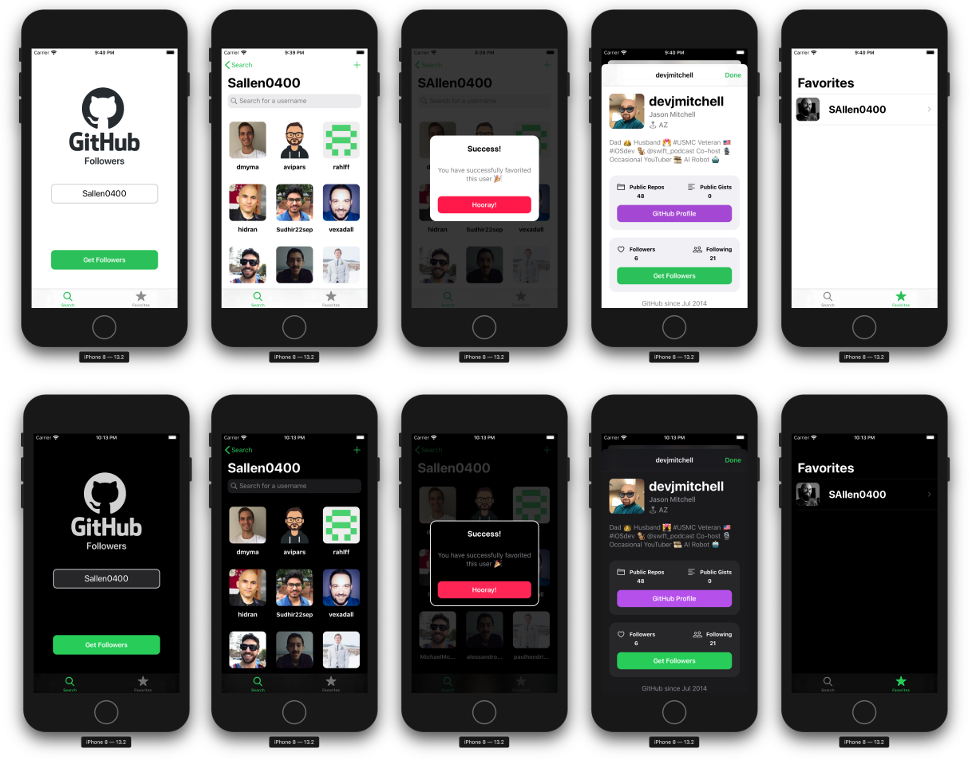

# GHFollower

#### Sean Allen's [iOS Dev Job Interview Practice - Take Home Project](https://www.youtube.com/watch?v=MSIe2y6Fee8)

The application let you search for a GitHub username, see the followers that this username has.

Search for a specific follower. See the information about this follower (profile, folowers, bio, number of repos, gists, etc). 

The app let you save a list of usernames (so you don't have to type them every time) and see those usernames followers.

---
App created in Xcode 11.4 for iOS 13+.

---

---

Course created by Sean Allen using GitHub API that covers:

* 100% Programmatic UI
* CollectionViews with the new DiffableDataSource
* Search Controllers
* Network Calls
* Parsing JSON with Codable
* Pagination of Network calls
* Image Caching
* No 3rd party libraries
* Dark Mode
* Custom Alerts
* Project organization
* Child View Controllers
* UITableView
* Delegation
* Persistence
* Proper Error Handling
* Empty States
* SafariViewController
* SFSymbols
* Dynamic Type
* StackViews
* Date Formatters
* Activity Indicators
* Reusable Components
* SceneDelegate
* Poor Network Testing
* Passing Data between views
* Overall iOS 13 best practices
* Most importantly… how it all ties together

